# Design audit - whole app, pre-deploy

Status: **awaiting approval. Nothing here has been built.**

Scope: every page (landing, sign-in, overview, targets, scan, inventory,
compose, login handoff, runs list, run detail, suites, usage, public proof)
and the shared components (shell, sidebar, command palette, buttons, forms,
chips, dialogs, toasts, empty/loading/error states).

Method: each screen was driven in a real browser against the MSW mocks at
1440×900 and at 390×844 (phone), dark. Screenshots are in
[`design-audit/before/`](design-audit/before/). Each screen was checked
against the `ui-ux-pro-max` skill's UX rules (`references/quick-reference.md`
§1-§10 and the checklist in `references/pro-rules.md`). **Only** its
accessibility, layout, interaction, forms, navigation and component-quality
rules were used. Its design-system generator, palettes, font pairings and
GSAP/animation-library presets were **not** used. Where the skill conflicts
with CLAUDE.md or `docs/DESIGN_SYSTEM_APP.md` (for example rounded corners,
light mode, extra typefaces or animation libraries), the repo wins, and
those conflicts are not listed here.

## The one-paragraph diagnosis

The landing page (Part L) and the compose/plan flow (Part P) look like a
premium product. The console around them doesn't yet. Every other console
page is a 24px title, a thin table and a lot of empty navy. The landing's
visual language (a gold-ruled eyebrow, large Cormorant display type, a clear
section rhythm, a strong primary action) stops at the sign-in door. The
biggest wins are not new features. They come from carrying the language the
landing already established through the console, and from giving the three
demo climaxes (the overview someone lands on, the run result, the public
proof) the weight they deserve.

## How to read each entry

- **Weak**: what's wrong, with the rule it breaks where one applies.
- **Upgrade**: the specific change.
- **Demo impact**: **High** means someone watching a demo would notice.
  **Medium** means it's noticed on a second look. **Low** means polish.
- **Class**: **Visual** is inside the Part P rules: no data layer, mocks,
  contract, routes or fetch/parse/decide changes. **Behaviour** would be its
  own clearly marked PR and is listed separately at the end.

---

## Ranked list

### 1. Console page header and type scale (shared, every console page) - High, Visual

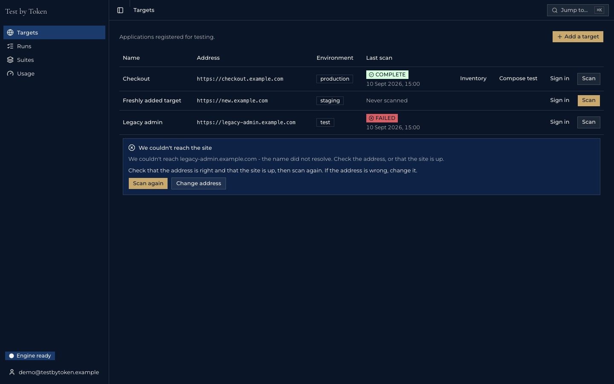

- **Weak:** The page title is a 14px label in the top bar, and on most pages
  the body starts with a grey sentence ("Applications registered for
  testing."). The pages that do have a title (compose, inventory, run,
  login) use about 24px Cormorant with no eyebrow and no rhythm. There are
  two `<h1>`s on the pages that have their own title (the top bar's and the
  page's), which breaks skill rule `heading-hierarchy`. Content runs
  edge-to-edge at 1440 with no maximum measure (`readable-measure`,
  `container-width`).
- **Upgrade:** One shared `PageHeader`: the landing's gold-rule eyebrow (for
  example "WORKSPACE · TARGETS"), a Cormorant display title at about
  36-40px, a one-line description, and actions aligned right. Set a single
  vertical rhythm (32/48) and a maximum content width for text-heavy pages.
  The top bar keeps the section name as plain text, not a heading, and each
  page owns exactly one `h1`.
- **Risk to check before building:** `e2e/targets.spec.ts:210` asserts a
  heading named "Runs", and `keyboard-spine.spec.ts` asserts the inventory
  page's level-1 heading. Both stay true if the runs page's own `h1` reads
  "Runs". If any behavioural test would need an edit, I stop and ask.
- **Bundle:** a small shared component that lands in every console route
  (estimate under 1 KB). I'll report the measured number.

### 2. Run detail - the demo's climax - High, Visual

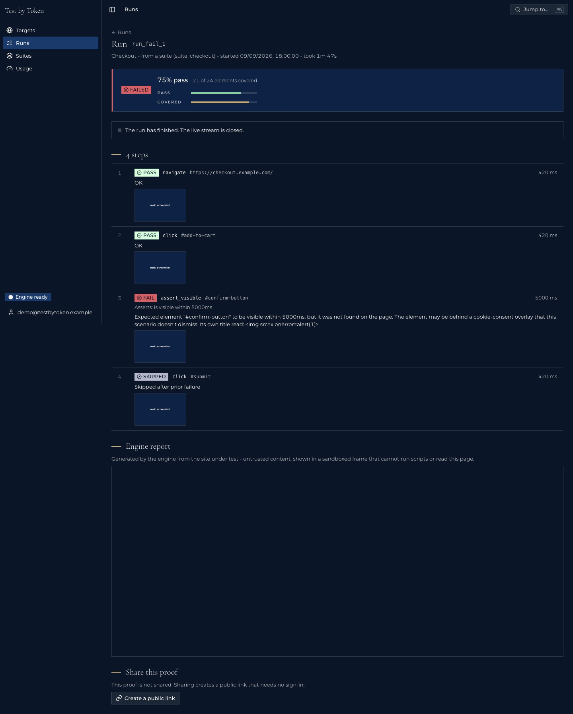

- **Weak:**
  - The page is titled with a machine id ("Run run_fail_1"), and the
    human context sits in a grey meta line.
  - The verdict card is the right idea, but the verdict itself is a small
    chip and "75% pass" is set at 18px, so the most important sentence on
    the page is body-sized.
  - Every step repeats a 130×80 "mock screenshot" thumbnail on its own
    line, which doubles the list's height.
  - The engine report is a 480px blank navy rectangle with no frame
    chrome, so in a demo it reads as broken.
  - On a phone, the step target URL breaks mid-word across three lines
    (`21-phone-run.jpg`).
- **Upgrade:**
  - The title becomes the target name, with the run id as a mono
    secondary line.
  - The verdict hero uses a display-size verdict word ("Failed" /
    "Passed" in Cormorant, carried by the existing status edge colour) and
    a large `PassRateCoverage` with both numbers at the same size. That
    needs a size variant on the existing component, and pass rate and
    coverage still can't be separated.
  - Step rows move to a fixed grid (index · chip · action/target ·
    duration), with the screenshot as a small right-aligned thumbnail.
  - The report frame gets a header bar ("Engine report · sandboxed · from
    the engine's origin") and a bordered frame, so an empty frame reads as
    a frame, not a gap.
  - Long targets truncate with an ellipsis and keep the full value in
    `title`.
- **Honesty:** nothing new is inferred. The verdict word comes from
  `run.status` through the same table `StatusBadge` uses, and a
  non-terminal run keeps today's "reported when the run finishes" line.

### 3. Overview - the first screen after sign-in - High, Visual (plus behaviour B1)

- **Weak:** The first thing a signed-in demo audience reads is _"This is
  the application shell - foundation only. Product screens … come in a
  later phase."_ That is internal copy, and it undercuts the demo on the
  most-seen console screen. Under it are four small outline buttons that
  repeat the sidebar.
- **Upgrade (visual):** Keep the "Welcome back" heading (`cold-start.spec`
  asserts it). Replace the copy with a static four-step path in the
  landing's "How it works" style: _Register a target → Compose a test →
  Watch it run → Share the proof_. Each step is a card linking to a page
  that already exists, and the gold-rule eyebrow numbers the steps. No
  numbers, no status, nothing fetched.
- Showing _real_ recent runs or target counts here needs new queries. That
  is behaviour, **B1** below.

### 4. Targets list and scan - High, Visual

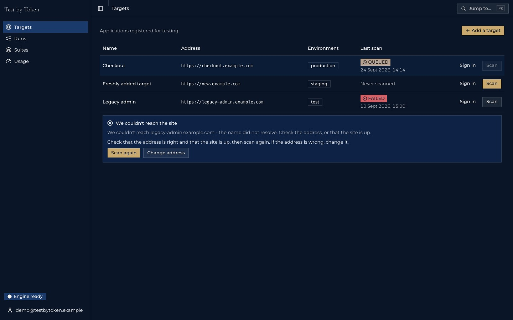
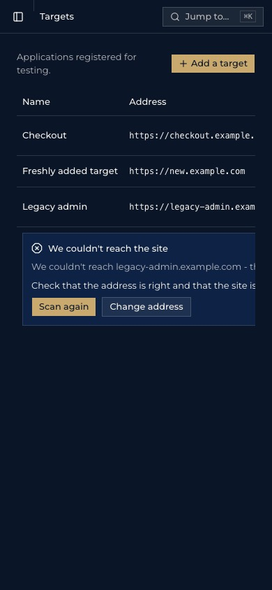

- **Weak:**
  - Column widths change when a scan is queued: "Address" jumps about 50px
    and the action column reflows (compare the two desktop shots), which
    breaks skill rule `layout-shift-avoid`.
  - Row actions are three unstyled text links and a button, with ragged
    widths across rows.
  - At 390px the table is clipped: last scan and every action are off the
    right edge, and so is the failure panel's text (`horizontal-scroll`,
    `mobile-first`).
  - Environment tags are outlined boxes that compete with the status chips.
- **Upgrade:**
  - A fixed table layout with explicit column widths, so a status change
    never moves a column.
  - Row actions become one consistent ghost-button group with the same
    link names, so the e2e `getByRole` calls still match. The per-row
    primary (gold "Scan" for never-scanned) stays.
  - Environment becomes a quiet eyebrow-style label.
  - Below `md`, the table becomes a stacked card per target: name,
    address, env, last scan, and actions on their own row.

### 5. Empty, loading and error states (shared) - High, Visual

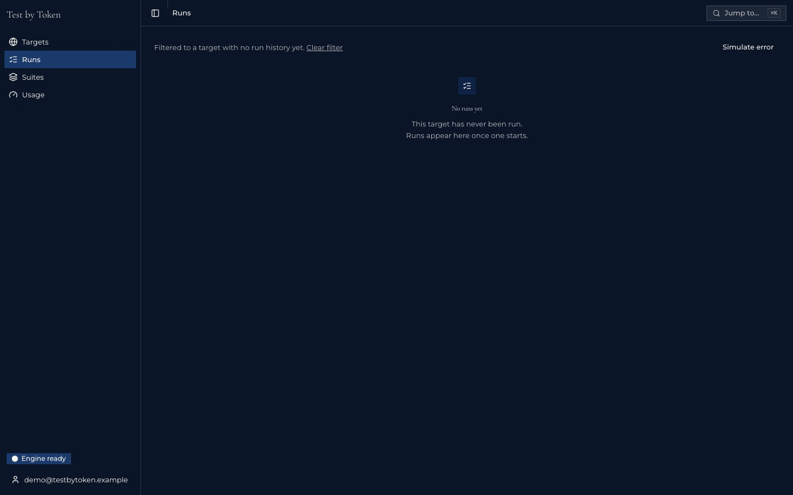
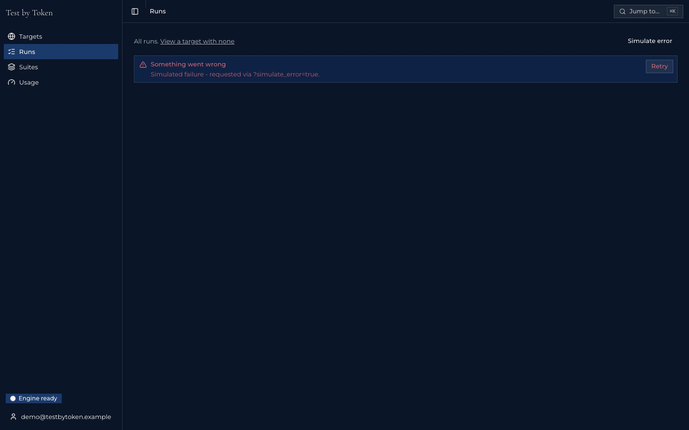
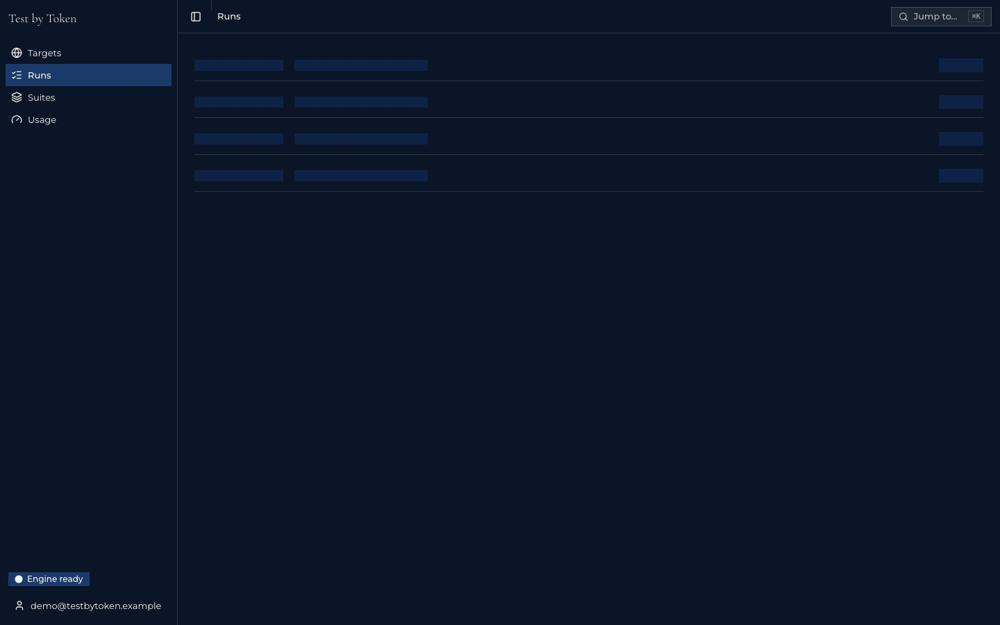

- **Weak:**
  - `EmptyTitle` is shadcn's `text-sm` (14px) in Cormorant, which has a
    much smaller x-height than Montserrat, so it renders _visibly smaller
    than its own description_. That is a straight type-scale bug.
  - The runs empty state has no action, which breaks the repo's own rule
    ("an empty state contains the action that fills it") and skill rule
    `empty-states`.
  - `ErrorState` is red body text on blue with a generic "Something went
    wrong".
  - The run page's loading skeleton is list-shaped, then the page loads
    header-shaped (a layout jump).
- **Upgrade:**
  - The empty title moves to the heading scale.
  - The runs empty state gets a "Compose a test" link to the existing
    route.
  - `ErrorState` gets a gold-ruled heading, the message in body colour and
    the reason in the destructive tone. The copy stays the same, so tests
    still pass.
  - Route-shaped skeletons (header block plus rows) for run detail and
    inventory, so nothing jumps. Reduced motion keeps its still version.

### 6. Public proof page - High, Visual (budget-sensitive)

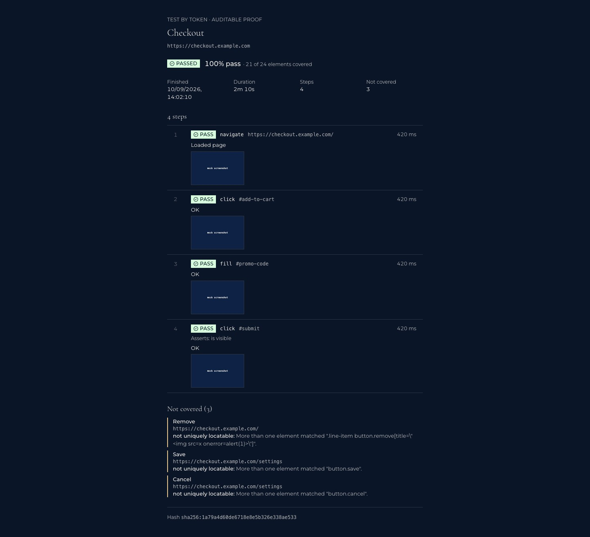

- **Weak:**
  - This is the page that gets _forwarded to people who never saw the
    product_, and it is the plainest page in the app: a small caps line,
    a 24px title, and a verdict chip with an 18px pass rate.
  - The "Finished" date wraps onto two lines.
  - The hash sits alone in a grey footer with no explanation of what it
    proves.
  - The screenshot placeholders repeat as they do on run detail.
- **Upgrade:**
  - The same verdict hero as run detail (#2), shared as markup rather than
    a new client component.
  - A stat row with tabular numbers that doesn't wrap.
  - A "What this hash proves" block that explains tamper-evidence in two
    lines, with the hash in mono.
  - Compact step thumbnails, and a brand footer.
- **Budget:** `/p/[token]` is capped at 316,517 bytes. The earlier landing
  link cost 3.1 KB and was reverted. Everything here is CSS and server
  markup, and I will measure it. If it doesn't fit, I stop and report.

### 7. Runs list - Medium-High, Visual (plus behaviour B2)

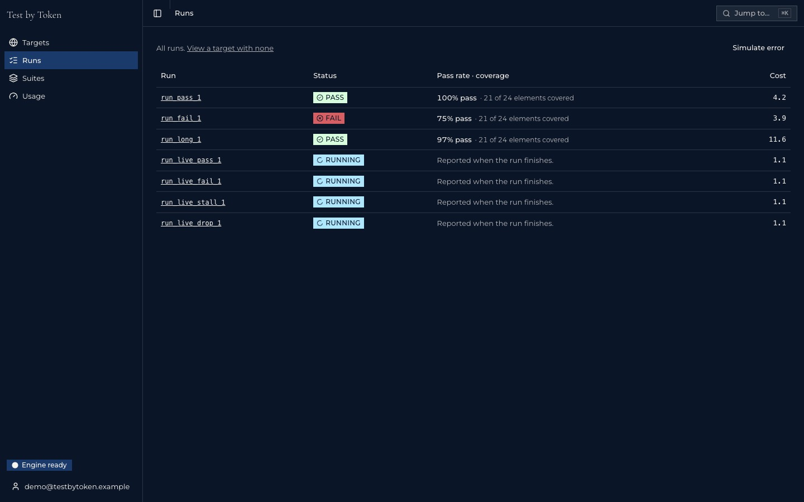

- **Weak:**
  - The only identifying column is an underlined mono id.
  - There is no "when" and no "how long", even though `started_at` and
    `finished_at` are already in the parsed response.
  - The dev-only controls ("Simulate error", "View a target with none")
    sit in the page header where an action would go.
  - The cost column shows "4.2" with no unit.
- **Upgrade:**
  - Add Started and Duration columns from fields already fetched.
  - The id becomes a quieter mono link.
  - "Tokens" goes in the cost header.
  - The two dev links move to a small "Dev" strip at the page foot, with
    the same names and targets (no e2e test uses them).
- The target _name_ needs the targets query joined in. That is **B2**.

### 8. Compose - after approval - Medium, Visual

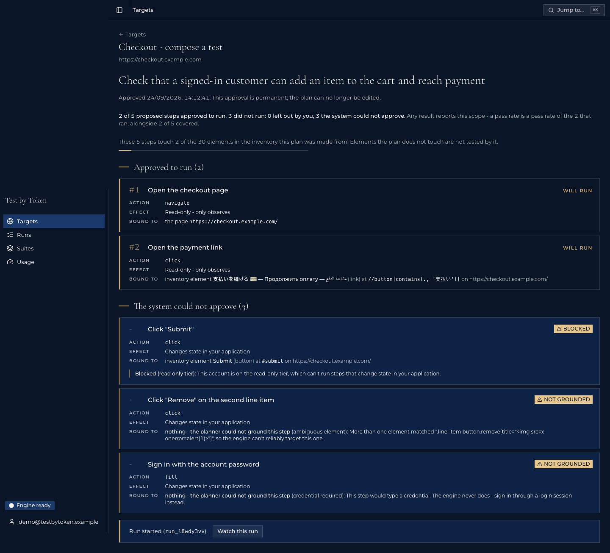
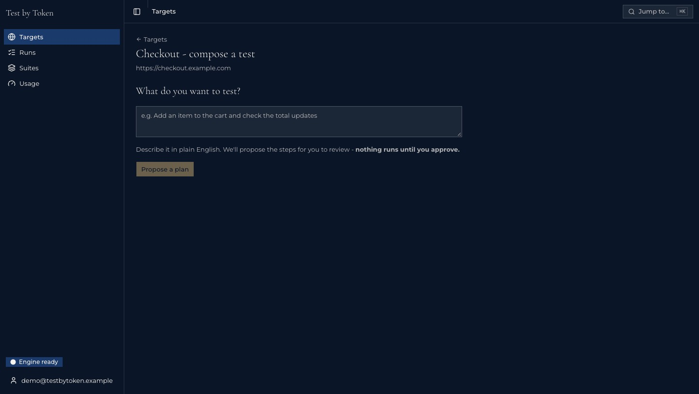

- **Weak:**
  - After "Approve and run", the moment the run starts is a one-line
    panel at the very bottom with an outline "Watch this run" button.
    That is the payoff of the whole flow, and it's styled as a secondary
    action.
  - Before a plan exists, the page is a narrow textarea, a very wide empty
    right side, and a disabled button that reads as brown.
- **Upgrade:**
  - The "Run started" panel becomes the primary moment: a gold primary
    "Watch this run", and the panel arrives with the existing `arrive`
    motion (still under reduced motion). There is no auto-navigation,
    which would be behaviour.
  - On the empty compose, a two-column layout with a static "What happens
    next" (propose → you review → it runs → proof).
  - The disabled primary gets a clearer disabled treatment. The contrast
    will be measured.

### 9. Sign-in - Medium, Visual

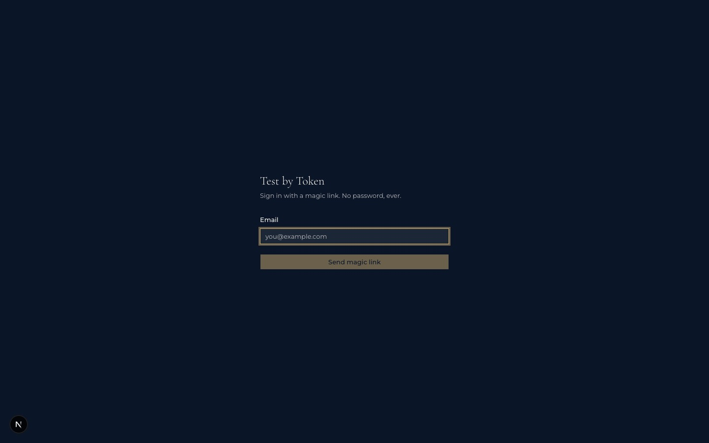

- **Weak:** It's centred on flat navy with a 24px wordmark and no link back
  to the site, so the step from the landing to sign-in feels like a
  different product. The disabled primary reads as brown.
- **Upgrade:** A split layout: on the left, the landing's hero image
  (already shipped, so no new asset) with the eyebrow and "No password,
  ever." At phone width it collapses to the form alone. Add "← Back to
  site" and a larger wordmark. The copy and field labels don't change.

### 10. Dialogs and forms (shared) - Medium, Visual (plus behaviour B3)

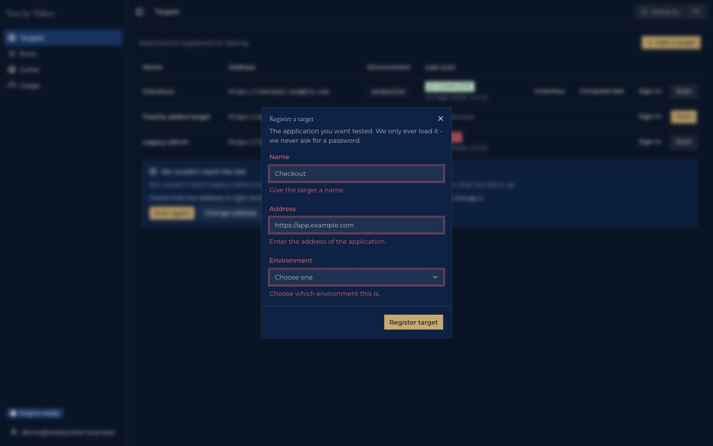

- **Weak:**
  - The dialog title is about 14px Cormorant, smaller than the body text.
  - The placeholders "Checkout" and "https://app.example.com" look like
    filled values, so a user sees a "filled" field marked "Give the target
    a name." (skill rule `input-helper-text`).
  - Label, input and error spacing is tight and uneven.
- **Upgrade:**
  - The dialog title moves to the heading scale.
  - The placeholders become "e.g. Checkout" and "e.g.
    https://app.example.com". This is a copy-only change, and I'll check
    that no test asserts it.
  - An 8px spacing rhythm for label → input → helper/error.
  - A footer band for the primary action.
- Fields stay red after they're corrected, until resubmit. That is the
  validation mode, so it's behaviour: **B3**.

### 11. Status chips (shared) - Medium, Visual (fills unchanged)

- **Weak:** Chip heights and letter spacing vary by context (tables, step
  rows, verdict card), and chips sit off the text baseline in step rows.
- **Upgrade:** One chip size token with baseline alignment and tabular caps.
  **The fills are not touched.** See discussion item D1.

### 12. Shell and sidebar (shared) - Medium, Visual

- **Weak:**
  - The wordmark is small, and it doesn't carry the landing's "TESTING AS
    A SERVICE" subline.
  - The active nav item is shown only by a blue fill block.
  - "Engine ready" is a saturated blue block, the loudest element in the
    sidebar, for a steady state.
- **Upgrade:**
  - The landing wordmark lockup.
  - A gold left rule plus the fill for the active item, which matches the
    status edge used elsewhere.
  - The workspace pill becomes a dot and text, with the same wording and
    the same states.

### 13. Inventory - Medium, Visual

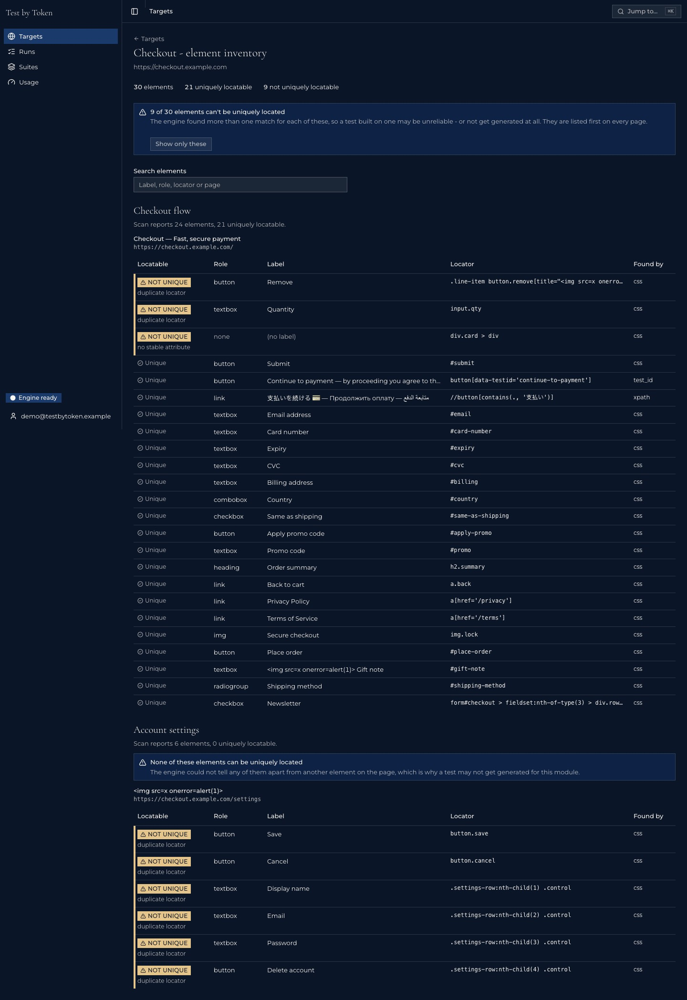

- **Weak:**
  - The summary ("30 elements 21 uniquely locatable 9 …") is a run-on
    sentence.
  - "Unique" rows use a low-contrast icon and text.
  - Two-line "not unique" rows and one-line "unique" rows give an uneven
    rhythm.
  - Truncated locators have no way to show the full value.
- **Upgrade:**
  - The summary becomes three stat cells plus the same gold proportion bar
    compose uses (drawn from counts the server sent, and bars are allowed).
  - Unique rows get measured contrast.
  - A fixed row height with the reason on hover or focus as a `title`
    (the full text also stays in the DOM).
  - Module headers stick while scrolling.

### 14. Login handoff - Medium, Visual

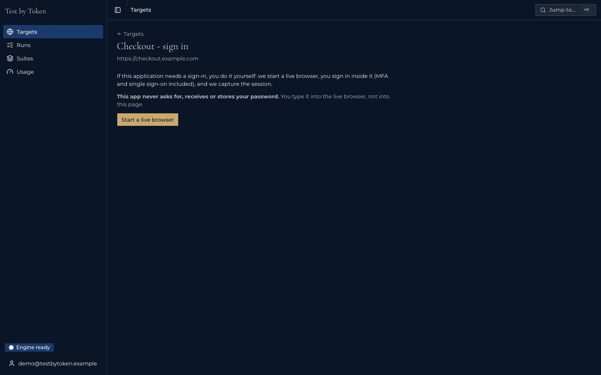

- **Weak:** The strongest trust copy in the product ("This app never asks
  for, receives or stores your password") is a bold sentence in a
  paragraph.
- **Upgrade:** A gold-ruled callout for that guarantee, and a static three-
  step strip (we start a browser → you sign in → session captured) above
  the button.

### 15. Command palette - Low-Medium, Visual (plus behaviour B4, B5)

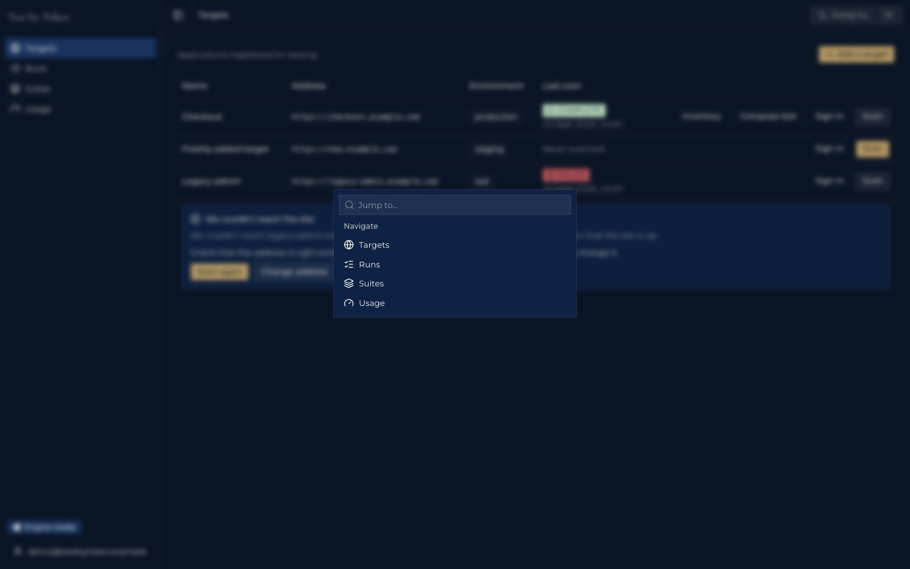

- **Weak:** It has four navigation entries, no keyboard hints, and no
  visual link to the brand.
- **Upgrade:** A footer hint row (↑↓ navigate · ↵ open · esc close), the
  eyebrow style for the group label, and a larger input.

### 16. Usage - Low-Medium, Visual (plus behaviour B6)

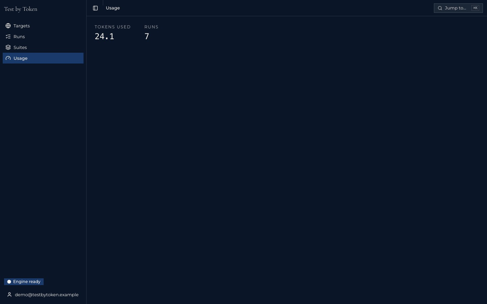

- **Weak:** Two bare numbers, "24.1" with no unit, and no period, even
  though `period_start` and `period_end` are already in the response.
- **Upgrade:** Stat cards with the unit and the period shown. The numbers
  are static, with no count-up.

### 17. Suites - Low, Visual

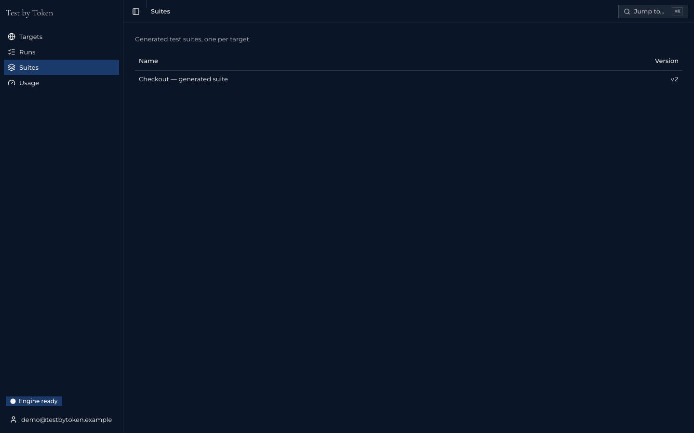

- **Weak:** One row, name and "v2", and the rest of the page is empty.
- **Upgrade:** Show `updated_at`, which is already in the response, and the
  version as a quiet label. Use the shared header (#1) so the page doesn't
  look abandoned.

### 18. Landing - Low, Visual

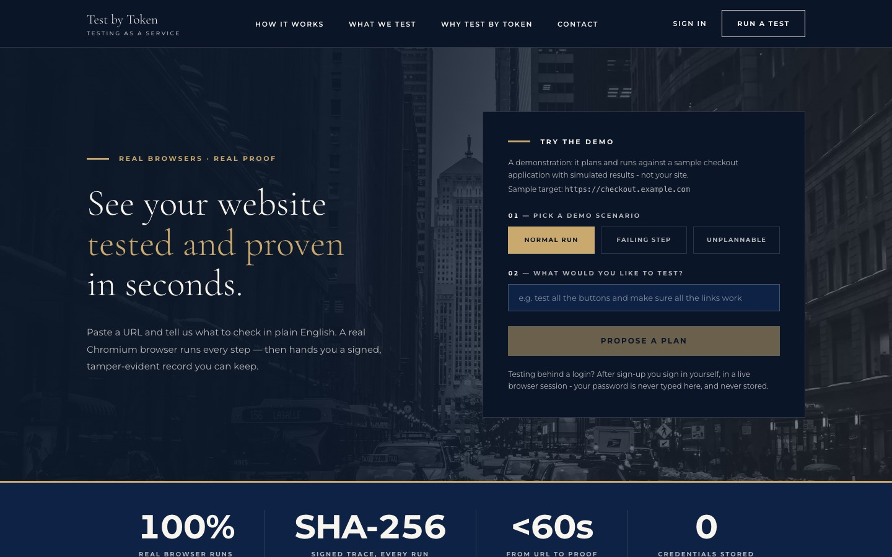

- **Weak:** This is the most finished page. In the footer, the placeholder
  links (Security, Pricing, API docs) render at low opacity and read as
  disabled, and they sit under a normal Product column.
- **Upgrade:** One opacity for every footer link, with contrast measured.

### 19. Toasts - Low, Visual

- **Weak:** Toasts only fire on share and scan failure, and they use the
  default shadcn layout.
- **Upgrade:** A left status rule, and the title in the heading face. No
  new toasts, since adding one would be behaviour.

---

## Behaviour - separate PRs, only if you want them

None of these are in the visual PRs. Each would be its own PR, clearly
marked as behaviour.

| #   | What                                                                                                                 | Why it's behaviour          |
| --- | -------------------------------------------------------------------------------------------------------------------- | --------------------------- |
| B1  | Overview shows real recent runs and targets                                                                          | New queries on a page       |
| B2  | Runs list shows target name                                                                                          | Joins the targets query     |
| B3  | Form fields revalidate as they're corrected                                                                          | Changes the validation mode |
| B4  | Palette lists recent runs, targets and actions                                                                       | New queries and commands    |
| B5  | ⌘K opens the palette _on top of_ an open dialog (seen while auditing); it should be suppressed while a modal is open | Changes a keyboard path     |
| B6  | Usage shows the budget and limit bar                                                                                 | Needs `GET /usage/budget`   |

## Raised for discussion, not for building

- **D1 - chip fills.** The filled status chips (Phase B, B2) are the
  loudest element on every console screen. The mint PASS fill in particular
  reads like highlighter. That was a measured accessibility decision (label
  4.5:1 on its own fill, fill 3:1 on the page), so I haven't proposed
  changing it. If you'd like a quieter fill, it would mean re-deriving the
  `--status-*-chip-fill` rungs in OKLCH and re-measuring. Your call.
- **D2 - touch targets.** The skill's CRITICAL rule is 44×44 hit areas.
  Our console buttons are 28-32px tall, which is fine for pointer use and
  above WCAG 2.2 AA's 24px. I'd enlarge hit areas under `(pointer: coarse)`
  only, which doesn't change the desktop look. This is included under #4
  and #10 unless you say otherwise.
- **D3 - dev indicator.** The Next.js dev badge overlaps the sidebar
  footer in `next dev`. It's dev-only and not in production builds, so it
  isn't on the list.

## Proposed build order

At most two PRs open at once. Each one gets before/after screenshots, a
measured bundle delta, and the full local suite (unit, e2e, typecheck,
lint, format, build, bundle-budget, contract-drift) before every push.

1. Shared: page header, type scale, and empty/error/loading states (#1, #5)
2. Run detail (#2)
3. Overview (#3)
4. Targets and scan (#4)
5. Public proof (#6)
6. Runs list (#7)
7. Compose after approval (#8)
8. Sign-in (#9)
9. Dialogs and forms (#10) with chips (#11)
10. Shell and sidebar (#12)
11. Inventory (#13) with login handoff (#14)
12. Palette, usage, suites, landing footer, toasts (#15-#19)
